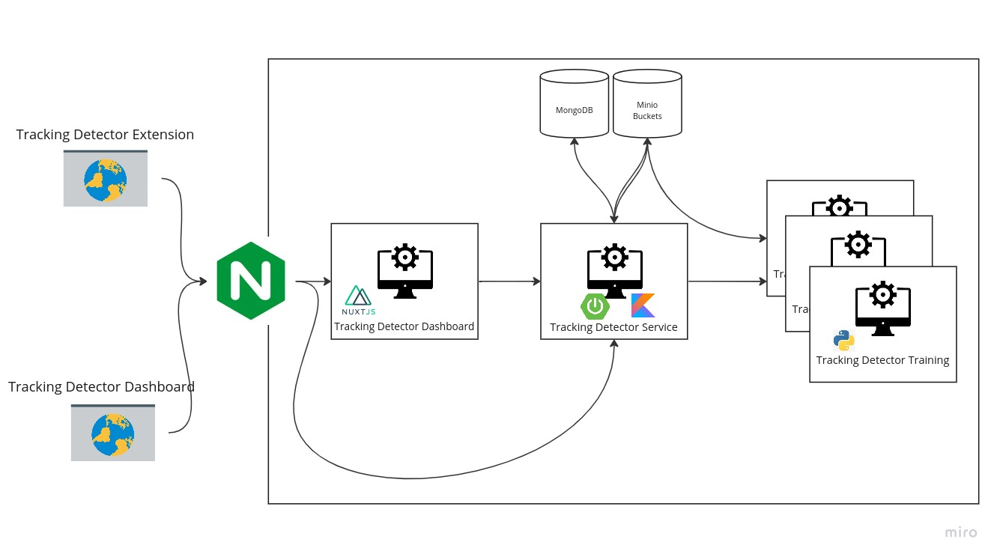

# Tracking Detector Org.

This is a non-profit organization which ships a ChromeExtension called TrackingDetector which can be used to block tracking requests in real time using ML.
To create such a product there are multiple components which play together to bring you the best user experience.
The model we are creating is updated once every month and you as a user can label requests in the extension and give submit it to 
our database. Your submissions will be included in the training data for the next models. You can also see the achieved accuracy of the model and the different types of models we ship.
This gives a transparent overview over our application. Furthermore, all of our code is OpenSource and can be easily setup for you at home.

## Infrastructure

In this chapter we look at the infrastructure of our application. This might be a good start if you want to train and test your own ML models.

### Components

As you can see the Tracking Detector Application consists of several services which
aim to create a seamless integration of trained models into the Tracking Detector Extension.
In the following paragraphs we go into detail on each service and what it does.

### [Tracking Detector Service](https://github.com/Tracking-Detector/tracking-detector-service)
The Tracking Detector Service is written in Kotlin and uses the Springboot framework. It is responsible for 
storing your labeled request and creating the training datasets. This is implemented with a job architecture which run asynchronously to the rest and
can be configured with a CRON pattern. The submitted request data gets stored in MongoDB and the created training data sets get stored in a Minio bucket in the csv.gz format.

#### [RequestDataExportJob](https://github.com/Tracking-Detector/tracking-detector-service/blob/main/src/main/kotlin/com/trackingdetector/trackingdetectorservice/job/RequestDataExportJob.kt)
The RequestDataExportJob takes a FeatureExtractor configuration and exports the requests data with the help of this extractor into a csv.gz file and stores it on the minio training data bucket. If you want to add a format for the data you can just throw together a new extractor and create a new JobConfiguration. Then the job will be added and can be executed.

#### [ModelTrainingJob](https://github.com/Tracking-Detector/tracking-detector-service/blob/main/src/main/kotlin/com/trackingdetector/trackingdetectorservice/job/ModelTrainingJob.kt)
The ModelTrainingJob loops over all the KerasModelDefinitions in the MongoDB and trains them calling a XMLRPC method on the python RPC Server. This RPC server then stores the trained model in the minio bucket for models.

#### [CleanUpJob](https://github.com/Tracking-Detector/tracking-detector-service/blob/main/src/main/kotlin/com/trackingdetector/trackingdetectorservice/job/CleanUpJob.kt)
The CleanUpJob deletes old JobRuns so that the MongoDB is fresh and does not get flooded with a lot of job runs that not needed.

